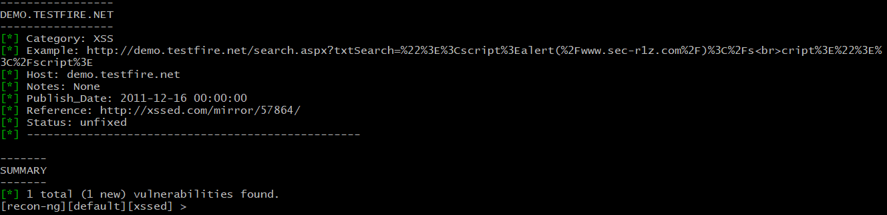

### Hector M. Molina Sandoz

# Week 16 Homework Submission File: Penetration Testing 1

Step 1: Google Dorking
Using Google, can you identify who the Chief Executive Officer of Altoro Mutual is:

>The CEO is Karl Fitsgerald

How can this information be helpful to an attacker:

>Social engineering, phishing, preferable whaling attacks.

---

Step 2: DNS and Domain Discovery
Enter the IP address for demo.testfire.net into Domain Dossier and answer the following questions based on the results:

Where is the company located:

>Sunnyvale, CA

What is the NetRange IP address:

>NetRange:       65.61.137.64 - 65.61.137.127

What is the company they use to store their infrastructure:

>CustName:       Rackspace Backbone Engineering

What is the IP address of the DNS server:

>65.61.137.117
>> nslookup demo.testfire.net
>>> primary name server = asia3.akam.net

---

Step 3: Shodan
What open ports and running services did Shodan find:

>Open ports: 80, 443, 8080

>Apache Tomcat/Coyote JSP engine1.1

---

Step 4: Recon-ng
Install the Recon module xssed.
Set the source to demo.testfire.net.
Run the module.
Is Altoro Mutual vulnerable to XSS:

>Yes (see image)

---

Step 5: Zenmap
Your client has asked that you help identify any vulnerabilities with their file-sharing server. Using the Metasploitable machine to act as your client's server, complete the following:

Command for Zenmap to run a service scan against the Metasploitable machine:

>nmap -T4 -A -v 192.168.0.10

Bonus command to output results into a new text file named zenmapscan.txt:

>nmap -T4 -A -v 192.168.0.10 > zenmapscan.txt

Zenmap vulnerability script command:

>nmap --script samba-vuln-cve-2012-1182 192.168.0.10

Once you have identified this vulnerability, answer the following questions for your client:

What is the vulnerability:
> Samba, SMB 3 

Why is it dangerous:

> Samba versions 3.6.3 and all versions previous to this are affected by a vulnerability that allows remote code execution as the "root" user from an anonymous connection. 

What mitigation strategies can you recommendations for the client to protect their server:
>"Samba contains a "hosts allow" parameter that can be used inside
smb.conf to restrict the clients allowed to connect to the server to a
trusted list. This can be used to help mitigate the problem caused by
this bug but it is by no means a real fix, as client addresses can be
easily faked." See URL: https://www.samba.org/samba/security/CVE-2012-1182

