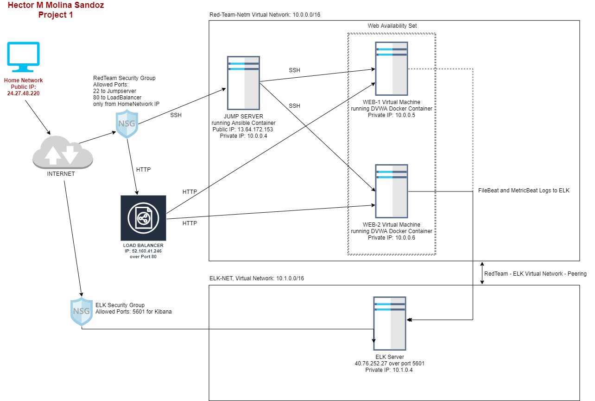
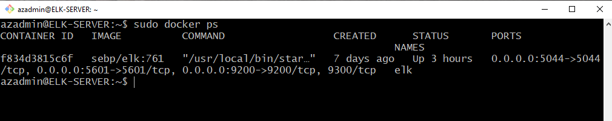

## Automated ELK Stack Deployment

The files in this repository were used to configure the network depicted below.

These files have been tested and used to generate a live ELK deployment on Azure. They can be used to either recreate the entire deployment pictured above. Alternatively, select portions of the YAML file may be used to install only certain pieces of it, such as Filebeat.

- [install-elk.yml](Ansible/install-elk.yml)

- [filebeat-config.yml](Ansible/filebeat-config.yml)

- [filebeat-playbook.yml](Ansible/filebeat-playbook.yml)

- [metricbeat-config.yml](Ansible/metricbeat-config.yml)

- [metricbeat-playbook.yml](Ansible/metricbeat-playbook.yml)

This document contains the following details:
- Description of the Topology
- Access Policies
- ELK Configuration
  - Beats in Use
  - Machines Being Monitored
- How to Use the Ansible Build
- Additional Linux Systems Administration - Resources

### Description of the Topology

The main purpose of this network is to expose a load-balanced and monitored instance of DVWA, the D*mn Vulnerable Web Application. Load balancing ensures that the application will be highly available, in addition to restricting access to the network.

- The loadbalancer helps ensure system/data availability.  It helps balance web traffic, if one web server goes down, there is another server to keep services going.
- The jumpserver (or jumpbox) provides an entry point so the servers can be administered via SSH.  It allows access to the network from an administrator that has access to the jumpserver.

Integrating an ELK server allows users to easily monitor the vulnerable VMs for changes to the files systems and system logs.

- Filebeat is used forward and centralize log data.  See https://www.elastic.co/guide/en/beats/filebeat/current//filebeat-overview.html

- Metricbeat is installed on your servers to periodically collect metrics from the operating system and from services running on the server. See https://www.elastic.co/guide/en/beats/metricbeat/7.14/metricbeat-overview.html

The configuration details of each machine may be found below.

| Name     | Function | IP Address | Operating System |
|----------|----------|------------|------------------|
| Jumpbox | Gateway  | 13.64.172.153 (Private 10.0.0.4)   | Linux            |
| Web-1   | Web Server | 10.0.0.5 | Linux            |
| Web-2   | Web Server | 10.0.0.6 | Linux            |
| ELK   | Log Server | 40.76.252.27 (Private: 10.1.0.4) | Linux            |
| RedTeamDVWALB     | Load Balancer | 52.160.41.246 | N/A                 |

### Access Policies

The machines on the internal network are not exposed to the public Internet.

Only the jumpbox machine can accept connections from the Internet. Access to this machine is only allowed from the following IP addresses:
- 24.27.48.220

Machines within the network can only be accessed by jumpbox.

- Jumpbox is the only machine that can access the network: Public IP: 13.64.172.153, Private IP: 10.0.0.4

A summary of the access policies in place can be found in the table below.

| Name     | Publicly Accessible | Allowed IP Addresses |
|----------|---------------------|----------------------|
| Jump Box | Yes              | From 24.27.48.220 over SSH|
| Web-1    |No                     |From 10.0.0.4 over SSH|
| Web-2    |No                     |From 10.0.0.4 over SSH|
| ELK      |No                 | From 24.27.48.220 over port 5601|
RedTeamDVWALB     | Load Balancer | From 24.27.48.220 over port 80 DVWA 

### ELK Configuration

Ansible was used to automate configuration of the ELK machine. No configuration was performed manually, which is advantageous because...

- There is no need to connect to every machine and configure it 'by-hand'.  All machines can be configured in uniform fashion, reducing the chance of misconfiguration.  It also provides scailibility when needing to configure a large amount of machines in a short amount of time.

The playbook implements the following tasks:

- The install-elk.yml installs Docker
- Then proceeds to install the package manager for Python known as PIP
- Followed by the installation of a Docker Python module
- Then performs a virtual memory expansion of the ELK server
- Finally downloading and starting the Docker web container

The following screenshot displays the result of running `docker ps` after successfully configuring the ELK instance.

### Target Machines & Beats
This ELK server is configured to monitor the following machines:
- IP: 10.0.0.5 and 10.0.0.6

We have installed the following Beats on these machines:
- Filebeat and Metricbeat

These Beats allow us to collect the following information from each machine:

- Filebeat is used forward and centralize log data. Installed as an agent on your servers, Filebeat monitors the log files or locations that you specify, collects log events, and forwards them either to Elasticsearch or Logstash for indexing. See https://www.elastic.co/guide/en/beats/filebeat/current//filebeat-overview.html

- Metricbeat is installed on your servers to periodically collect metrics from the operating system and from services running on the server. Metricbeat takes the metrics and statistics that it collects and ships them to the output that you specify, such as Elasticsearch or Logstash. See https://www.elastic.co/guide/en/beats/metricbeat/7.14/metricbeat-overview.html

### Using the Playbook
In order to use the playbook, you will need to have an Ansible control node already configured. Assuming you have such a control node provisioned:

SSH into the control node and follow the steps below:
- Copy the install-elk.yml file to /etc/ansible/ directory.
- Update the hosts file to include the machine that will be configured via playbook
- Run the playbook, and navigate to http://40.76.252.27:5601/ to check that the installation worked as expected.

### Additional Linux Systems Administration - Resources

[Linux Systems Administration](Linux/linux-files.md)

